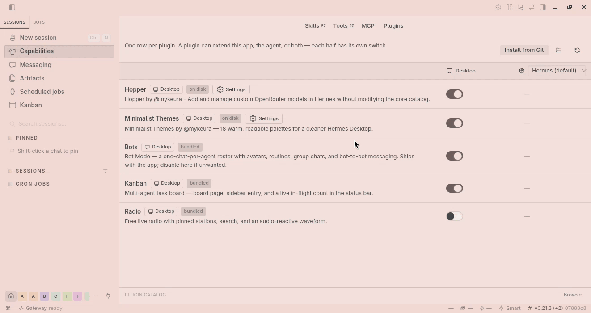

# Hopper

**Hopper by @mykeura adds and manages custom OpenRouter models in Hermes without modifying the built-in catalog.**


Hopper gives you a small, personal OpenRouter catalog that you can edit from Hermes. It can contain free models while they are temporarily available, as well as paid models available through OpenRouter. Model availability and pricing are controlled by OpenRouter and may change.

## Default models

Hopper v1.3.0 starts with these models:

```text
inclusionai/ling-3.0-flash-vl:free
inclusionai/ling-3.0-flash-fin:free
inclusionai/ling-3.0-flash-sante:free
```

## Demo



## Manage models in Hermes

1. Open **Capabilities → Plugins** and select **Hopper**.
2. Click **Settings** to open the OpenRouter model list.
3. Add or remove one OpenRouter model ID per line, then click **Save models**.
4. To return to the bundled list, click **Reset Ling defaults**.

Close the settings window with its close button, press **Escape**, or click the backdrop. After saving, reopen the Hermes model picker so the updated catalog appears in the selector.

## Install or upgrade

Copy this directory to `~/.hermes/plugins/hopper` (or install it with
`hermes plugins install owner/repo`), then:

1. Restart Hermes (or its gateway).
2. Open **Capabilities → Plugins** and click **Rescan**.
3. Select Hopper and enable its **Desktop** and **Agent** halves.
4. Open **Settings** to confirm or edit the model list.
5. Choose a Hopper model from the Hermes model selector.

Your existing model list (`~/.hermes/plugin-data/hopper/models.txt`) is kept
on upgrade.

## Optional CLI

You can also manage the catalog from the command line:

```bash
python ~/.hermes/plugins/hopper/manage.py list
python ~/.hermes/plugins/hopper/manage.py add "provider/model-id"
python ~/.hermes/plugins/hopper/manage.py remove "provider/model-id"
python ~/.hermes/plugins/hopper/manage.py reset
```

Hopper uses your normal `OPENROUTER_API_KEY`.

## A small way to support the project

If you are considering the Nous Portal Personal plan, you can use [my Nous Portal referral link](https://portal.nousresearch.com/r/mykeura). It takes **$15 off your first month** and gives me a **$10 referral credit** that helps cover the API usage behind my ongoing work on Hopper and related Hermes plugins. It is entirely optional, but it is a simple way for both of us to benefit.

The offer is for new customers starting a new Personal subscription. It applies to the first invoice, and each payment card can be used for only one referral; if the card has already backed another referral, the discount is reversed and no referral reward is paid.

## License

MIT License.

Hermes Agent and OpenRouter are separate projects/services. Hopper is an independent plugin and is not affiliated with or endorsed by Nous Research, OpenRouter, or InclusionAI.
